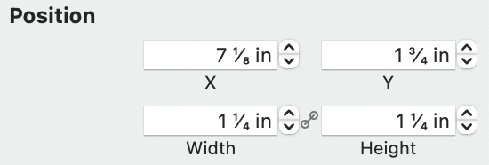

#  AJRInspectors

## Introduction

The AJRInspectors are a class of objects used to enable object inspection in your application. They are set up in a three fold manner, and to use them, you'll take the following steps:

1. Set up an AJRInspectorViewController. This will create a view that holds the inspectors. It also maintains a stack of objects to be inspected, so you'll push and pop object's off its stack to see their inspectors appear.

2. Prepare you views for inspection. You do this my implementing the method `inspectorIdentifiers(forInspectorContent:)`. This method will call `super` to get an array of inspectors, and then add it's own inspectors to the end of the array returned by `super`. The method returns an array of `AJRInspectorIdentifier`. 

    You'll also need to add an entry in your `.ajrplugindata` file that maps the inspector identifier to an XML filename.

3. Finally, you'll need to define XML content, described below, for each of the inspectors.

For all of this to work, you're objects must be subclassed from NSObject, and respond to key/value coding protocols. This is necessary, because while the inspector architecture is written fully in Swift, it's designed to function with Obj-C classes. See later sections for more details.

## XML

The inspectors are defined by writing basic XML files to describe the layout of the inspector. The elements defined here will be linked to your inspected objects using the key/value coding and key/value observing protocols via an `NSController` object.

There are three basic types of XML objects defined: document, groups, and slices. Documents define the top level of the XML, groups define how items in the inspector are grouped and labeled, and finally, the slices define the actual value content.

### Object Attributes

Both groups and slices will define attributes. We'll discuss individual attributes below, but all attributes follow these rules.

An attribute has a “base” name. For example:

```xml
<group title="My Title">
```

Here we see the `title` attribute. In this case, the value of the `title` attribute is defined as `My Title`, and cannot be affected by outside influences. 

Alternatively, we might expressess the above as:

```xml
<group titleKeyPath="translator.My_Title">
```

By appending `KeyPath` to the end of the attribute name, the attribute will now be bound to the model/view controller model. In the above example, we see a special case of this where we've bound to `translator`. Inspectors add a special case to my translation architecture, and will cause the system to first look in a file called `<inspector_file>.strings` prior to using the normal search method for the strings files. This makes translating the inspectors quite easy.

We'll talk more about bindings further on.

### XML Header

Each document must start with an XML header. This will generally be as follows:

```xml
<?xml version="1.0" encoding="utf-8" ?>
```

## Document Objects

There's two basic document level objects: `inspector` and `inspector-include`. The first is the main object you'll use, as it defines the "top level" of your inspected content. The second is used for XML files included from other inspectors. Includes are useful for breaking large inspectors into smaller, more managebale chunks.

The basic structure of a document will look like:

```xml
<?xml version="1.0" encoding="utf-8" ?>
<inspector>
    <group title="Graphic">
        <group title="Position" ... />
        </group>
        <include file="DrawText"/>
        <include file="DrawStroke"/>
        <include file="DrawFill"/>
        <include file="DrawShadow"/>
        <include file="DrawReflection"/>
    </group>
</inspector>
```

The included files above might look something like this:

```xml
<inspector-include>
    <group title="Fill">
        <slice type="boolean" ... />
        <slice type="color" ... />
    </group>
</inspector-include>
```

***NOTE:*** The above files elide important content in the `...` sections, which will be discussed in their appropriate sections below.

Document objects current have no attributes.

### Groups

Groups are basic units of grouping in the inspector. There's only one group object, but it's position is important, as how the group is rendered may change depending on the level at which it is defined.

At the top level, a group will get a title with a special background, as defined by the system appearance, while at lower levels, the title will simply be bolded text, perhaps with a horizontal divider.

Here's a fairly complex example of an inspector:


Here you can see the top level groups for "AI Explorer" and "Document" and a number of subgroups: "Code Definition", "Paper", "Grid", "Guides", "Variables", "Units", "Printer & Paper Size", "Page Orientation", and "Document Margins". Note how the top level groups have a lighter color background while the subgroup titles have no background. Likewise, each subgroup, when followed by another subgroup, has a horizontal divider, but there's no horizontal divider when followed by a top level group.

Also, while the groups will manage their spacing, there may be special instances when you want to have extra space for some reason. When this is case, the groups allow for adding additional values to their top or bottom margins.

**Group Attributes**

|Attribute|Type|Description|
| :-- | :-- | :-- |
| title | String | Determines the title of the section. All sections, no matter level, may have a title. |
| visible | Bool | If `true`, then the section is visible, otherwise the section is collapsed. |
| hidden | Bool | This is the opposite of `visible`. |
| forEach | [Object] | Points to an array of objects, and causes the section to be repeated once for each object. This only really works with the `KeyPath` variant.
| borderMarginTop | Float | Defines the spacing above the group. You usually shouldn't need to set this, as the default will work just fine. |
| borderMarginBottom | Float | Defines the spacing below the group. You usually shouldn't need to set this, as the default will work just fine. |
| borderColorTop | NSColor | The color of the top border. Not all groups will have a border. The default is the named color `inspectorDividerColor`, allowing you to change this globally via your asset catalog. |
| borderColorBottom | NSColor | The color of the bottom border. Not all groups will have a border. The default is the named color `inspectorDividerColor`, allowing you to change this globally via your asset catalog. |

## Slices

The main work horse of the XML files are the slices, as these define the actual content, rather than the organization of the XML. All slices have one attribute.

All slices have the following attributes in common:

| Attribute | Type | Description|
| :-- | :-- | :-- |
| type | String | This attribute must appear and the engine will generate an error if it does not. We'll describe all the available types in the following sections. |
| label | String | The label that appears to the left (or right) of the inspector content. This can be omitted if there's no need to label the content. |
| fullWidth | Bool | If `true`, the field will span the entire width of the inspector, including the label area. This is mostly meant for `table` slices, but may be useful for others. |

### Slice Merging

One other imporant aspect of slices is that some slices can be "merged" with the predecessor. So, for example, say you have to number fields where it would make sense to them to be on the same line. For example, a width and height field. These fields will automatically "merge" if the second field defined doesn't have a `label`. You can prevent the merge by defining the `label` on the second field as “”.

For example:

```xml
<group title="Graphic">
    <group title="Position">
        <slice type="float" subtitle="X" valueKeyPath="..."\>
        <slice type="float" subtitle="Y" valueKeypath="..."\>
        <slice type="float" subtitle="Width" valueKeyPath="..."\>
        <slice type="float" subtitle="Height" valueKeypath="..."\>
    </group>
</group>
```

This would create a simple inspector for the `x`, `y`, `width`, and `height` properties of an object where `x` and `y` were on one line while `width` and `height` were on their own line.


### Slice Types

As mentioned above, each slice must define a `type` attribute, and this attribute cannot have the `KeyPath` extension. Below we discuss all the various types and their attributes.

### `attributedString` Type

Defines a slice to editing an attributed strings. This has similar functionality to a plain string field, by adds additional controls for changing the text's attributes. The bound value should be a attributed string, otherwise and error is generated.

| Attribute | Type | Description |
| :-- | :-- | :-- |
| editable | Bool | Determines if the field can be edited. |
| selectable | Bool | Determines if the field is selectable. A field may be not editable, but no selectable. |
| enabled | Bool | Determines if the field is enabled. A disable field cannot be edited or selected. |
| isContinuous | Bool | If `true`, all edits in the field will cause the bound object to receive the value. |
| emptyIsNull | Bool | If `true`, the empty string is considered the same as `nil`. This is mostly useful to get the nullPlaceholder string to appear. |
| nullPlaceholder | String | A string that will be displayed when the bound value is empty (see above) or `nil`. |
| value | NSAttributedString | An attributed string to display and edit. Note that this currently only has limited functionality (if any) with Swift's `AttributedString` class, and expects an `NSAttributedString`.

#### `attributedString` Sample

```xml
<slice type="attributedString" 
       label="Text" 
       valueKeyPath="controller.selection.primaryText.attributedString" />
```


### `boolean` Type

This generally generates a check box.

| Attribute | Type | Description |
| :-- | :-- | :-- |
| value | Bool | The bound value. |
| enabled | Bool | Whether the control is active. |
| title | String | The title of the control. This is different from the `label` attribute which generally appears to the left of the control, as `title` appears to the right of the control. |
| negate | Bool | If `true`, negate the value with fetching or setting. |

#### `boolean` Sample

```xml
<slice type="boolean" 
       title="Active" 
       valueKeyPath="controller.selection.primaryText.active" />

```


### `button` Type

Create a basic Cocoa button. Note that the button cannot currently be styled. The button is also one of the few slices with out any kind of value as input, it simply just sends an action to the provided target when pressed.

| Attribute | Type | Description |
| :-- | :-- | :-- |
| title | String | The button's title. |
| enabled | Bool | If the button is enabled. |
| action | Selector | The action to send on the button being depressed. If this isn't set, the button will do nothing. |
| target | Object | The target of the action. This may be `nil`, in which case the action is sent down the responder chain. |

### `color` Type

Presents a color editor. Note that this is a modified color well that presents a menu of color choices when clicked.

| Attribute | Type | Description |
| :-- | :-- | :-- |
| value | NSColor | The bound value. |
| enabled | Bool | Whether the control is active. |

#### `color` Sample

```xml
<group title="Fill">
    <slice type="boolean" 
           title="Active" 
           valueKeyPath="controller.selection.primaryFill.active" />
    <slice type="color" 
           label="Color"
           valueKeyPath="controller.selection.primaryFill.color" />
</group>
```


### `choice` Type

This is probably the most complicated, but one of the most useful of the slice types. It's complicated, because it can present a number of different appearances, and also because it allows the dynamic presentation of the inspector segments. 

For example, say you have choice of three items, and each item has a different set of properties. With this slice, you can control dynamically show a different section of the inspector depending on the choice selected.

You currently have three basic appearances: Pop Up Menu, Segmented Control, or Combo Box. The first two are probably the most common.

Also, you have two methods for determining the values in the inspectors. The first option is this slice can have children of type `choice`. Each choice defines one value that can appear in the options. The second option is to provide a list of objects via a binding. Both have their uses.

| Attribute | Type | Description | 
| :-- | :-- | :-- |
| style | string | Defines the style. Currently acceptable styles include: `popUp`, `segments`, and `comboBox`. |
| enabled | Bool | If the primary control is active. |
| allowsNil | Bool | If `true`, a placeholder value is created for `nil` and the user can view and set the bound value to `nil`. |
| mergeWithRight | Bool | Normally this slice tries to avoid being merged with other controls, but if your chocies are narrow enough, you might desired this behavior, so set this to `true`. |
| valueType | String | Determines the value type of the bound value. This cannot use the `KeyPath` variant. Currently valid values are: `integer`, `bool`, `float`, `string`, and `object`. If this key is missing or contains an invalid value, an error will be generated. |

When using the `valueType` `integer`, `bool`, `float`, or `string`, you can define the following keys:

| Attribute | Type | Description |
| :-- | :-- | :-- |
| value | &lt;T&gt; | Binds to a value of the typed defined by `valueType`. When present, `values` may not be present. |
| values | [&lt;T&gt;] | Binds to array of values defined by `valueType`. When present, `value` may not be present. |

If you're using the `object` value type, you may also define the following attributes:

| Attribute | Type | Description |
| :-- | :-- | :-- |
| value | Object | The bound value. |
| objects | [Object] | An array of objects to use as choices. |
| choiceTitle | Key&nbsp;Path | This is slightly special in that the key path provided will be sent to the object to determine the title. |
| titleWhenNil | String | The title to display if `value` is `nil`. |

As an alternative to `choiceTitle`, you can also have your objects define the `AJRInspectorChoiceTitleProvider` protocol, which allows them to return either a title string or an image. Note that a `choiceImage` attribute may be added in the future.


#### `choice`

The `choice` slice may have childre with the element name `choice`. Choices define the following attributes:

| Attribute | Type | Description |
| :-- | :-- | :-- |
| title | String | The title of the option. |
| imageKey | NSImage | An image to display. This can be used with `title`. |
| imageName | String | The name of an image to display. This is useful if the image is stored in an asset catalog. |
| imageBundle | String | When looking for an image via `imageName`, this defines the bundle ID of where the image should be searched. For example, for the AJRInterface framework, the bundle ID would be `com.ajr.framework.AJRInterface`. |
| separator | Bool | If `true`, a separator item will be displayed. This is only useful for styles that could have a separator, like the `popUp` style. |
| value | &lt;T&gt; | The value of the choice. |
| objectPredicate | Expression | This option is only available for value type `object` and must be present. This represents an expression used to determine if the object matches the current choice. |

Remember that choices can have child content. This content will only be displayed when the choice is selected.

### `date` Type

A field used for date display and input. It defines the following attribute:

| Attribute | Type | Description |
| :-- | :-- | :-- |
| editable | Bool | Determines if the field can be edited. |
| selectable | Bool | Determines if the field is selectable. A field may be not editable, but no selectable. |
| enabled | Bool | Determines if the field is enabled. A disable field cannot be edited or selected. |
| continuous | Bool | If `true`, all edits in the field will cause the bound object to receive the value. |
| emptyIsNull | Bool | If `true`, the empty string is considered the same as `nil`. This is mostly useful to get the nullPlaceholder string to appear. |
| nullPlaceholder | String | A string that will be displayed when the bound value is empty (see above) or `nil`. |
| alignment | NSTextAlignment | Valid values are `left`, `center`, `justified`, `natural`, and `right`. |
| color | NSColor | The color of the text. |
| backgroundColor | NSColor | The background color of the next.|
| value | Date | The bound value. |
| format | String | A valid date format. See Unicode's [documentation](http://www.unicode.org/reports/tr35/tr35-31/tr35-dates.html#Date_Format_Patterns) for details. |

#### `date` Sample

```xml
<slice type="date" 
       label="Created" 
       format="MMMM d, YYYY" 
       valueKeyPath="controller.selection.documentInfo.creationDate" />
```


### `file` Type

Presents a field with a button that allows the user to select a file from the file system. This slice expects to be bound to a URL.

| Attribute | Type | Description |
| :-- | :-- | :-- |
| editable | Bool | Whether the field can be edited. This control access to the field and the button. You'll generally want file fields to be non-editable. |
| selectable | Bool | Whether the text in the field can be selected. |
| enabled | Bool | Whether the field is enabled. When not enabled, no interactions are allowed with the field. |
| emptyIsNull | Bool | When `true`, if the field is empty, the the bounds value is treated as `null`. |
| nullPlaceholder | String | A string to display when the field is `null`. The value is displayed as the "placeholder" string in the field, so will appear as grey, rather than black (or white) text. |
| alignment | NSTextAlignment | Determines the alignment of the field. May be `left`, `right`, `center`, `justified`, or `natural`. |
| color | NSColor | The field's text color. |
| backgroundColor | NSColor | The field's background color. |
| continuous | Bool | When `true`, the bound value is updated as the user types. |
| url | URL | The URL to the file. |
| utis | [String] | An array of strings containing UTIs. If set, these are the only file types that are selectable. When not set, all files are selectable. |
| defaultsKey | String | A string to a `UserDefaults` key used to save the path where the last file was selected. When selecting the next file, this path will be used as the starting point for the open panel. |

#### `file` Sample

```xml
<slice type="file" 
       urlKeyPath="controller.selection.selectedCodeDefinition.outputURL" 
       label="Path" 
       editable="false" 
       utisKeyPath="controller.selection.selectedCodeDefinition.language.fileUTIs" defaultsKey="codeGeneratorSavePanelPath" />
```


### `font` Type

Allows inspecting and editing a font property.

| Attribute | Type | Description |
| :-- | :-- | :-- |
| value | NSFont | The inspected font. |
| enabled | Bool | Whether the slice is active. |

#### `font` Sample

***TODO:*** *I need to create a sample of this.*

### Geometry Type

**NOTE:** You will not create a geometry slice directly. Rather, subclasses will use this type to edit their values.

The geometry type is the superclass of a number of slice types for editing various "multivalue" values. For example, points, sizes, rectangles, etc... 

These types share these common keys:

| Attribute | Type | Description |
| :-- | :-- | :-- |
| enabled | Bool | Whether the fields are enabled. |
| units | Unit | The units used in the field. This is a Swift `Unit` class, and generally speaking will be a length type, but could conceivably be different. |
| displayInchesAsFractions | Bool | This is a special case for inches, and when true, inches will be displayed as fractional values. For example, .5 inches will be displayed as ½. |
| increment | CGFloat | Determines the increment / decrement of the field when the stepper control is pressed. By default, this will be +/- 1. |

Beyond these, geometry subtypes will display two, three, or four values with some control on how these are displayed. See the subtypes for what keys are available to affect the keys.

#### `point` Geometry Subtype

| Attribute | Type | Description |
| :-- | :-- | :-- |
| value | CGPoint | The displayed value. |
| subtitle1 | String | The title under the first value. By default, this is "X". |
| subtitle2 | String | The title under the second value. By default, this is "Y". |

#### `point` Geometry Sample


#### `size` Geometry Subtype

| Attribute | Type | Description |
| :-- | :-- | :-- |
| value | CGSize | The displayed value. |
| subtitle1 | String | The title under the first value. By default, this is "Width". |
| subtitle2 | String | The title under the second value. By default, this is "Height". |
| valuesCanLink | Bool | If `true`, the values are linked. This means that when you change one value, `width` or `height`, the other value will also change by the same amount. This can be useful for maintaining the aspect ratio of the size. |

#### `size` Geometry Sample

```xml
<slice type="size" 
       label="Offset" 
       valuesCanLink="false" 
       valueKeyPath="controller.selection.primaryShadow.offset"/>
```


#### `rect` Geometry Subtype

This is basically the `point` and `size` subtypes combined into one inspector slice.

| Attribute | Type | Description |
| :-- | :-- | :-- |
| value | CGSize | The displayed value. |
| subtitle1 | String | The title under the first value. By default, this is "X". |
| subtitle2 | String | The title under the second value. By default, this is "Y". |
| subtitle3 | String | The title under the third value. By default, this is "Width". |
| subtitle4 | String | The title under the forth value. By default, this is "Height". |
| secondValuesCanLink | Bool | If `true`, the third and forth (width/height) values are linked. This means that when you change one value, `width` or `height`, the other value will also change by the same amount. This can be useful for maintaining the aspect ratio of the size. |

#### `rect` Geometry Sample

```xml
<group title="Position" 
       hiddenKeyPath="controller.selection.isTemplateGraphic">
    <slice type="rect" 
           valueKeyPath="controller.selection.frame" units="points" 
           displayUnitsKeyPath="controller.selection.document.unitOfMeasure.unit" 
           displayInchesAsFractions="true"
           incrementKeyPath="controller.selection.document.unitOfMeasure.defaultIncrement"/>
</group>
```



#### `insets` Geometry Subtype

This is used to edit the NSEdgeInsets structure.

| Attribute | Type | Description |
| :-- | :-- | :-- |
| value | NSEdgeInsets | The displayed value. |
| subtitle1 | String | The title under the first value. By default, this is "Top". |
| subtitle2 | String | The title under the second value. By default, this is "Left". |
| subtitle3 | String | The title under the third value. By default, this is "Bottom". |
| subtitle4 | String | The title under the forth value. By default, this is "Right". |

#### `insets` Geometry Sample

```xml
<group title="Document Margins">
    <slice type="insets"
           valueKeyPath="controller.selection.margins" 
           units="points" 
           displayUnitsKeyPath="controller.selection.unitOfMeasure.unit" 
           displayInchesAsFractions="true" 
           incrementKeyPath="controller.selection.unitOfMeasure.defaultIncrement" />
</group>
```


### `level` Type

The `level` type displays a "level" control. Basically, it's kind of like a slide that shows a percentage. It also has a mode that can display as "stars" to provide a ratings type control.

| Attribute | Type | Description |
| :-- | :-- | :-- |
| value | Float/Integer | The value of the level. It will display as a percentage of `minValue` to `maxValue`. |
| valueScale | Float | A multiplier applied to `value`. |
| minValue | Float | The minimum value of the control. `value` should be greater than or equal to this value. It defaults to 0.0. |
| maxValue | Float | The maximum value of the control. `value` should be less than or equal to this value. It defaults to 1.0. |
| warningValue | Float | When `value` is greater than or equal to this value, the control will display in its `warningColor`. |
| criticalValue | Float | When `value` is greater than or equal to this value, the control will display in its `criticalColor`. |
| style | String | The style of the control, may be "relevancy", "continuousCapacity", "discreteCapacity", or "rating". Note that the "rating" style will display as "stars". |
| placeholderVisibility | String | May be "automatic", "always", or "whileEditing". The default is "automatic". See the NSLevelIndicator for more information. |
| editable | Bool | Determines whether or not the control may be edited. |
| enabled | Bool | Determines whether the control is "enabled". This is like `editable`, except the control will be displayed in a "disabled" state when not enabled. |
| color | NSColor | The color of the control. |
| warningColor | NSColor | The color of the control when `value` exceeds `warningValue`. |
| criticalColor | NSColor | The color of the control when `value` exceeds `criticalValue`. |

#### `level` Sample

```xml
<slice type="level" 
       style="rating" 
       minValue="0" 
       maxValue="5" 
       valueScale="20.0" 
       labelKeyPath="translator.Rating" 
       valueKeyPath="controller.selection.tags.starsRating"/>
```

***NOTE:*** Note how the `valueScale` property is used to scale the value from 0 to 100, even though the display scale is 0 to 5. 


### `integer` and `float` Types

These are grouped, because they behave identically with the only difference being the underlyning numeric type.

| Attribute | Type | Description |
| :-- | :-- | :-- |
| value | Integer/Float | The bound value. |
| minValue | Integer/Float | The minimum value of `value`. |
| maxValue | Integer/Float | The maximum value of `value`. |
| increment | Integer/Float | The amount the stepper controls increment `value`. The default is 1. |
| format | Integer/Float | The format string used to display the value. This should be as described by the [NSNumberFormatter](https://developer.apple.com/documentation/foundation/nsnumberformatter?language=objc) or [NumberFormatter](https://developer.apple.com/documentation/foundation/numberformatter?language=swift) documentation. |
| units | Unit | The units used to display the number. The default for this is `nil`. Setting it will cause the number to be displayed with units. Note that the units are the underlying units of the value. For example, if you were displaying a screen coordinate, the units would be "points". |
| displayUnits | Unit | The display units of `value`. This is different from the `units`, because it's used to control the actual display. For example, if `units` is "points", you might be displaying in "inches". Changing this will affect the display format. By default, this is the same as `units`. |
| displayInchesAsFractions | Bool | This is a special case for inches, and when `true`, inches will display using standard inch fractions. For example, "1.5" would display as "1 ½". |
| placeholderString | String | If the bounds value is `nil`, then this string will be displayed.&star; |

&star; This is one place we have some interesting interactions with Swift and Obj-C. In Obj-C, base C types can never be `nil`. As such, if you want to make use of `placeholderString`, then you have to have a return type of `NSNumber`, which can be `nil`. However, in Swift, you can declare optional numeric types, like `Int?` or `Float?`, but since we make use of Obj-C bindings (to remain comppatible with Obj-C), properties declared with option base types won't work, as they won't be visible to Obj-C as properties. To get around this, you should create a synthetic property that maps your value to Number. For example:

```Swift
    public var maximumClippingNorm: Float? = nil
    public var inspectedMaximumClippingNorm : NSNumber? {
        get { 
            if let maximumClippingNorm { 
                return NSNumber(value: maximumClippingNorm)
            }
            return nil
        } 
        set {
            maximumClippingNorm = newValue?.floatValue 
        }
    }
```

#### `integer` and `float` Sample

```xml
<slice type="float" 
       label="Clipping"
       valueKeyPath="controller.selection.optimizer.inspectedGradientClipMin"
       subtitle="Min"
       placeholderString="Unset"/>
<slice type="float" 
       valueKeyPath="controller.selection.optimizer.inspectedGradientClipMax" 
       subtitle="Max" 
       placeholderString="Unset"/>
```


### `paperOrientation` Type

Allows the selection of a paper orientation, either "landscape" or "portrait". Obviously this is fairly specific to one use.

| Attribute | Type | Description |
| :-- | :-- | :-- |
| value | PaperOrientation | The orientation of the paper, either "portrait" or "landsacpe". This maps to `NSPaperOrientation` or `NSPrintInfo.PaperOrientation`. |
| paperValue | AJRPaper | This binds to a property of type `AJRPaper`, which is a small class to make handling papers types easier, as Apple's own support for paper is a little lacking. If not set, this defaults to "letter". |
| enabled | Bool | Whether or not the control is active. |
| units | Unit | The units used to display the paper size. |
| displayInchesAsFractions | Bool | If yes, and the units are inches, then the units will be displayed with fractions. For example, "1.5" would display as "1 ½". |

#### `paperOrientation` Sample

```xml
<group title="Page Orientation">
    <slice type="paperOrientation" 
           valueKeyPath="controller.selection.orientation" 
           paperValueKeyPath="controller.selection.paper" 
           unitsKeyPath="controller.selection.unitOfMeasure.unit" 
           displayInchesAsFractions="true" 
           fullWidth="true" />
</group>
```


### `string` Type

Inspects a basic string that may be `nil`. This is one of the most basic inspectors, but one you're likely to use quite a bit. One useful thing to keep in mind is that when set to `editable`, you can use this slice to display static values.

| Attribute | Type | Description |
| :-- | :-- | :-- |
| editable | Bool | Whether the field can be edited. This control access to the field and the button. You'll generally want file fields to be non-editable. |
| selectable | Bool | Whether the text in the field can be selected. |
| enabled | Bool | Whether the field is enabled. When not enabled, no interactions are allowed with the field. |
| emptyIsNull | Bool | When `true`, if the field is empty, the the bounds value is treated as `null`. |
| nullPlaceholder | String | A string to display when the field is `null`. The value is displayed as the "placeholder" string in the field, so will appear as grey, rather than black (or white) text. |
| alignment | NSTextAlignment | Determines the alignment of the field. May be `left`, `right`, `center`, `justified`, or `natural`. |
| color | NSColor | The field's text color. |
| backgroundColor | NSColor | The field's background color. |
| continuous | Bool | When `true`, the bound value is updated as the user types. |
| value | String | The value displayed in the field. |

#### `string` Sample

```xml
<slice type="string" 
       valueKeyPath="controller.selection.selectedCodeDefinition.codeName" 
       label="Code Name" 
       nullPlaceholderKeyPath="controller.selection.defaultCodeName" />
```


### `store` Type

This is another fairly specialized inspector slice. It's used to inspect an `AJRStore`, which is used by the `AJRExpression` collection or expression parsing and evaluation. The `AJRExpression` class can be configured to use a base variable store, represented via teh `AJRStore` class. See the documentation on `AJRExpressions` for more information.

This inspector allows the user to create and remove variable from the store. The variables may be of any type supported by the expression classes, which may be extended via the plug-in model.

| Attribute | Type | Description |
| :-- | :-- | :-- |
| value | AJRStore | A variable store used by `AJRExpression`. |
| usesAlternatingRowBackgroundColors | Bool  | If `true`, the displayed table will use alternating background colors for its rows. |
| hasVerticalGrid | Bool | If `true`, the displayed table will show vertical lines between columns. |

#### `store` Sample

```xml
<group title="Variables">
    <slice type="store" 
           valueKeyPath="controller.selection.variableStore" 
           fullWidth="true" />
</group>
```

***NOTE:*** This also makes use of the `fullWidth` key, which is technically available to all slices, but especially useful when displaying tables.


### `table` Type

This allows the display of tables and the editing of data in the tables. While at it most basic, this can be fairly straight forward to use, at it's most complicated, it can get quite involved. For that reason, we'll show a couple of examples.

***NOTE:*** While very powerful, the table type isn't 100% fleshed out. It's useful for a number of things, but it should include better support for the various types in the columns. For example, numnber types currently don't have settings for things like min and max values. Likewise, there's no controls for changing things like the foreground or background colors of the cells, and it'd probably be nice to do that.

Likewise, there's currently no way to expand the types found in the table. This should be accessible via the plug-in architecture like the types are for the geometry types. That's something that'll be added when needed.

| Attribute | Type | Description |
| :-- | :-- | :-- |
| dataSource | Object | An object that responds to the `NSTableViewDataSource` protocol and will provide data to the table view. This is for advanced interactions only, and you normally shouldn't need this. |
| delegate | Object | An object that responds to the `NSTableViewDelegate` protocol. This is for advanced interactions, and you normally shouldn't need to use this. |
| values | [Object] | Provides an array of objects. Note that the object's should be able to respond to the `NSKeyValueCoding` protocol. |
| hasTitles | Bool | If `true` the table view will display titles. |
| usesAlternatingRowBackgroundColors | Bool | If `true`, the table's rows will use alternating background colors. |
| hasVerticalGrid | Bool | If `true`, the columns will have vertical dividers. |
| actionTarget | Object | An object that will receive the actions of the `addAction` and `removeAction` methods. |
| addAction | Selector | This is represented as a string that will be passed to `NSSelectorFromString()`, and should produce a valid selector. The selector, when called, is expected to add a new row to the data at the end of the current selection. |
| removeAction | Selector |  This is represented as a string that will be passed to `NSSelectorFromString()`, and should produce a valid selector. The selector, when called, is expected to remove the current selection from the data. |
| addMenu | NSMenu | This is a NSMenu that will appear when the user clicks the plus icon below the table. It's probably rare that you'll need this, but is present for advanced operations. Anything selected from the menu should act upon the current selection. |
| selectedRowIndexes | [Int] | Represents an array of row indexes of the current selection. This is just one way to access the selected objects. If bound, multiple selection will be permitted. You should bind to `selectedRowIndexes`, `selectedObjects`, or `selectedObject`, but only one. |
| selectedObjects | [Object] | This is an array of the currently selected objects. If bound, multiple selection will be permitted in the table. You should bind to `selectedRowIndexes`, `selectedObjects`, or `selectedObject`, but only one. |
| selectedObject | Object | This is the currently selected object. If bound, the table will not support multiple selection. You should bind to `selectedRowIndexes`, `selectedObjects`, or `selectedObject`, but only one. |

#### `column` Sub-element

In addition to the above properties, the slice may also have special child elements: `column`. The `column` may have the following properties:

| Attribute | Type | Description |
| :-- | :-- | :-- |
| type | String | Defines the value type of the cell. The table currently supports the following types: "integer", "float", "time", "string", and "boolean". See below for more information. |
| title | String | The title of the column. This is only relevant if the table displays titles. |
| titleAlignment | NSTextAlignemnt | The alignment of the table: `left`, `center`, `right`, `natural`, or `justified`, although `justified` is probably irrelevant. |
| editable | Bool | If `true`, the table's cell will be editable. Note that for this to work, the objects in the table must be mutable. |
| alignment | NSTextAlignment | The alignment of the values in the cells. This may be ignored for sometimes. Valid values are `left`, `center`, `right`, `natural`, and `justified`. |
| width | Float | The width of the cell. This will fix the width of the column. If you want the column to be resizable, leave this unbound. When resizing, all columns without size will be resized evently. |
| editOnAdd | Bool | When `true`, when the user clicks the  button, the first column of the newly added object will be selected for editing. |
| font | NSFont | The font used to display the cell. |

***NOTE:*** Tables should always define at least one column.

##### Column Types

| Type | Kind | Description |
| :-- | :-- | :-- |
| integer | Integer | An integer value. We don't currently have sub-bindings for min/max values, but probably should. |
| float | Float | A Floating point value. We don't currently have sub-bindings for min/max values, but probably should. |
| string | String | A string value. We don't currently have bindings for things like `nullPlaceholder`, but probably should. |
| time | NSTimestamp| A time stamp. This will be displayed using "DD:HH:MM.SS", or two digits each of days, hours, minutes, and seconds. |
| boolean | Bool | Displays as a check box. |

#### `table` Sample 1

```xml
<group titleKeyPath="translator.Chapter Stops">
    <slice type="table" 
           valuesKeyPath="controller.selection.file.chapters" 
           fullWidth="true" 
           actionTargetKeyPath="controller.selectedObjects.file" 
           addAction="addChapter" 
           removeAction="removeChapter" 
           selectedRowIndexesKeyPath="controller.selection.file.selectedChapters">
        <column titleKeyPath="translator.Start" 
                type="time" 
                valueKeyPath="startTime" 
                titleAlignment="center" 
                alignment="right" 
                width="82.0" />
        <column titleKeyPath="translator.Title" 
                type="string" 
                valueKeyPath="title" 
                titleAlignment="center" 
                alignment="left" 
                editable="true" />
    </slice>
</group>
```

This is a fairly simple example showing the editing of chapter stops on a media file. It has basically two columns, "Start" and "Title", which are bound and displayed via the `column` elements.


#### `table` Sample 2

```xml
<group title="Code Definition">
    <slice type="table" 
           valuesKeyPath="controller.selection.codeDefinitions" 
           hasTitles="false" 
           actionTargetKeyPath="controller.selectedObjects" 
           addAction="createCodeDefintion" 
           removeAction="removeCodeDefinition:" 
           usesAlternatingRowBackgroundColors="false" 
           hasVerticalGrid="false" 
           selectedObjectKeyPath="controller.selection.selectedCodeDefinition">
        <column type="string" 
                valueKeyPath="name" 
                editable="true"/>
    </slice>
    <slice type="string" 
           valueKeyPath="controller.selection.selectedCodeDefinition.name" 
           label="Name" 
           nullPlaceholder="No Name"/>
    <slice type="choice" 
           valueType="object" 
           label="Library" 
           objectsKeyPath="controller.selection.allLibraries" 
           valueKeyPath="controller.selection.selectedCodeDefinition.library"/>
    <slice type="choice" 
           valueType="object" 
           label="Language" 
           objectsKeyPath="controller.selection.selectedCodeDefinition.library.supportedLanguagesForCodeGeneration" 
           valueKeyPath="controller.selection.selectedCodeDefinition.language"/>
    <slice type="choice" 
           style="popUp" 
           label="Role" 
           valueType="string" 
           valueKeyPath="controller.selection.selectedCodeDefinition.inspectedRole">
        <choice title="Both" value="Both"/>
        <choice title="Inference" value="Inference"/>
        <choice title="Training" value="Training"/>
    </slice>
    <slice type="string" 
           valueKeyPath="controller.selection.selectedCodeDefinition.codeName" 
           label="Code Name" 
           nullPlaceholderKeyPath="controller.selection.defaultCodeName"/>
    <slice type="file" 
           urlKeyPath="controller.selection.selectedCodeDefinition.outputURL" 
           label="Path" 
           editable="false" 
           utisKeyPath="controller.selection.selectedCodeDefinition.language.fileUTIs" 
           defaultsKey="codeGeneratorSavePanelPath"/>
    <slice type="integer"
           valueKeyPath="controller.selection.selectedCodeDefinition.batchSize" 
           label="Batch Size"/>
</group>
```

This is much more involved example. In this case, we're showing two things. First, we show up we're binding to a table with one column. But note that in the table slice, we bind to a `selectedCodeDefinition` property. When we do this, we can then bind to it in the code following the table. This allows us to then provide a more advanced editor for the selected object in the table.

Also, while fairly involved, this shows a nice sampling of some of the other slice types and how they can be used.


